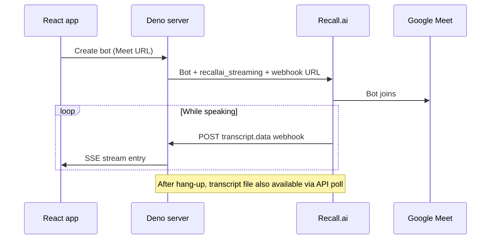

# HelpWrite

HelpWrite turns team calls into documentation updates, while you're on the call. It joins your call, captures the conversation, identifies high level goals for your edits, then actually drafts edits to your knowledge base. 

## What it does (product view)

1. **Join the call** — You paste a Google Meet link and send a Recall.ai meeting bot into the call. The bot listens like a silent participant.
2. **Live transcript** — As people speak, the transcript appears in real-time. That text is the source of truth for everything downstream.
3. **Goals** — To start the editing process, you first generate goals, using the transcript to identify the overarching themes for your planned edits. A call to Anthropic's API suggests 1–3 strategic documentation goals (short titles + descriptions), e.g. “Update payroll setup guide for Australia.”
4. **Article changes** — Given those goals and the articles in your knowledgebase, you can then call the Antrhopic API for complete edits to relevant articles in the knowledge base. You review diffs in the UI.

Today the knowledge base is **mock data** (not a real CMS). The Recall + Anthropic integrations are real.

## Main pieces

| Piece | Role |
|-------|------|
| **Web app** (`src/`) | React UI: connect to a meeting, show live transcript, goals grid, article list, diff viewer. |
| **API server** (`server.ts`) | Deno backend on port 8000: creates Recall bots, receives live transcript webhooks, calls Claude for goals and edits. |
| **Recall.ai** | Meeting bot + **Recall.ai Transcription** in low-latency mode (`prioritize_low_latency`, English). Sends `transcript.data` events to your server while the call is in progress. |
| **Anthropic** | Generates goals and rewritten articles from transcript + mock articles. |

## Running locally

You need [Deno](https://deno.com/) 2.x.

### 1. Environment

Copy `.env.example` to `.env` and set:

- `RECALL_API_TOKEN` — from the Recall dashboard  
- `ANTHROPIC_API_KEY` — for goal/edit generation  
- `RECALL_PUBLIC_URL` — **required for live transcript during the call** (see below)

### 2. Expose the server for live transcript

Recall delivers live captions to a **public HTTPS webhook**, not to `localhost`. In a second terminal:

```bash
ngrok http 8000
```

Put the ngrok HTTPS origin in `.env` (no path, no trailing slash), e.g.:

```text
RECALL_PUBLIC_URL=https://abc123.ngrok-free.app
```

Restart the API server after changing `.env`.

### 3. Start everything

Terminal A — API:

```bash
deno task server
```

Terminal B — UI:

```bash
deno task dev
```

Open the Vite URL (usually `http://localhost:5173`), paste your Meet link, connect, and speak. Lines should appear in **Live Call transcript** while you are still in the meeting.

## How live transcript works



## License / notes

This repo is a demo scaffold. Meeting bots must comply with your org’s recording and consent policies.
